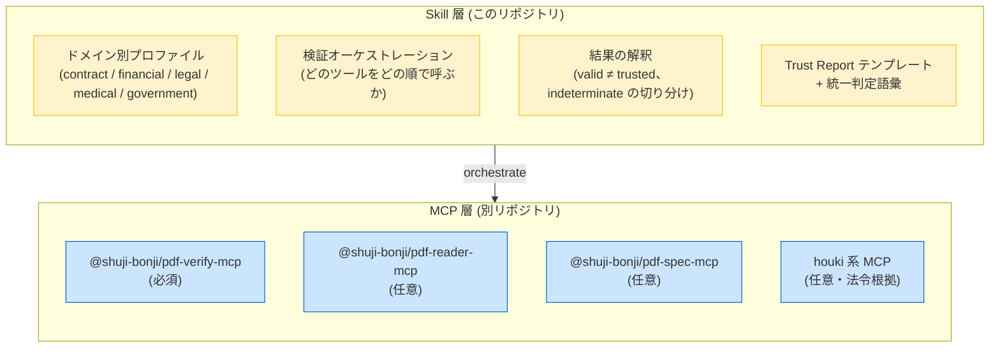

# pdf-trust-skill

[](https://opensource.org/licenses/MIT)
[](https://github.com/shuji-bonji/pdf-trust-skill)

🌐 [English version (README.md)](./README.md)

[PDF family](https://github.com/shuji-bonji#-pdf-family) の MCP サーバ群を編成して、PDF の**信頼性を監査**する **Claude Skill**。「この PDF は本物か・改ざんされていないか・信用してよいか」に対し、暗号学的署名検証・改ざん検知・PAdES/PDF-A チェック・（任意で）法令根拠の照合をドメイン別プロファイルで実行し、推奨判定付きの **Trust Report** を返します。

> **スコープ**: 本 Skill が判定するのは**真正性（authenticity）であって真偽（truth）ではありません**。文書が原本のまま完全であることを検証するものであり、内容の正しさ・法的有効性の最終判断は利用者（および必要に応じて有資格者）に委ねます。

## 何を提供するのか

このリポジトリは **MCP server ではなく Skill** です。ユーザーが「この PDF は信用できる？」と尋ねたときに、Claude が PDF family の MCP を**どう組み合わせて使うか**を Markdown でまとめた行動指針です。



### なぜ MCP ではなく Skill なのか

PDF family の設計原則は「**決定論的計算（暗号・パース・判定）は MCP サーバ、手順・解説・知識は Skill**」。pdf-verify-mcp v0.7.0 からは 4 値判定そのものも決定論的ルールエンジン `evaluate_policy` が下します — **ジャッジはコード、ナラティブは LLM**。Skill はプロファイルの編成・発火ルールの解説・法令根拠の引用を担い、判定を上書きすることはありません。

## 監査の流れ

1. **プロファイル選択** — 文書のドメイン（契約書・請求書・診療文書…）を特定し、`references/` の該当プロファイルを読み込む
2. **検証と判定**（全ファイル一括） — `evaluate_policy` にプロファイルを渡して実行。内部で `verify_signatures` / `verify_integrity` / `detect_pades_level`（長期保存プロファイルでは `validate_conformance` も）が走り、verdict と発火ルール ID が返る。同じファイル・同じプロファイルなら常に同じ判定（LLM のブレの影響を受けない）
3. **結果の解釈** — 発火ルールを内蔵の解釈表で平易に解説（例: *POL-CAUTION-TRUST-NOT-EVALUATED は「暗号学的完全性のみ確認、署名者の身元は未評価」*）。必要なら個別ツールで深掘り
4. **プロファイル別チェック** — evaluate_policy が扱わない項目（契約書の署名時刻突合、医療・行政の PDF/UA など）
5. **法令根拠**（任意） — houki 系 MCP で条文原文を出典 URL 付きで取得
6. **Trust Report** — 検査ごとの根拠ツールを明記した表 + 警告 + エンジンの 4 値判定:

| 判定 | 意味 |
|---|---|
| `trust_and_use` | valid + 信頼チェーン確認 + 失効なし + プロファイル必須チェック全通過 |
| `use_with_caution` | 暗号学的には valid だが身元未評価 / 失効不明 |
| `human_review_required` | indeterminate、DocMDP 違反、必須チェック不合格 |
| `reject` | invalid — ダイジェスト不一致・署名検証失敗・失効確認済み |

## ドメイン別プロファイル

| プロファイル | 想定文書 | 重点 |
|---|---|---|
| [contract](skills/pdf-trust/references/contract.md) | 契約書・NDA・発注書 | 署名者の身元、署名時刻の整合、PAdES B-T 以上 |
| [financial](skills/pdf-trust/references/financial.md) | 請求書・決算書・申告書 | 長期検証可能性（LTV・PDF/A）、電子帳簿保存法 |
| [legal](skills/pdf-trust/references/legal.md) | 訴訟資料・法務文書全般 | 証拠性、増分更新の全履歴 |
| [medical](skills/pdf-trust/references/medical.md) | 診療情報提供書・検査報告書 | 最も保守的な判定、PDF/UA |
| [government](skills/pdf-trust/references/government.md) | 行政文書・公共告知 | PDF/A 長期保存、PDF/UA、深い証明書チェーン（GPKI） |
| general | 上記以外 | 基礎検証のみ |

## 前提となる MCP 群

| MCP | 必須 | 役割 |
|---|---|---|
| [@shuji-bonji/pdf-verify-mcp](https://www.npmjs.com/package/@shuji-bonji/pdf-verify-mcp) | **必須** | 署名検証・改ざん検知（**v0.10.0+ はリビジョン間のオブジェクト単位差分も**）・PAdES レベル・PDF/A 検証（**v0.11.0+ は PDF/A-4 も**）。**v0.21.0 以降を推奨。** 変わったことが 3 つある。v0.15.0 で、追えない `/Prev` を飲み込まなくなった —— それ以前はチェーンを完全なものとして返していたため、8 リビジョン 5 署名の文書が「1 リビジョン」と報告され、**全履歴を約束する報告書は書けなかった**。v0.16.0 で答えがフィールドになった（`revisionChain: { status, missing }`）—— それまでは信号が `notes` の英文だけで、この Skill は**散文の照合**で全履歴を約束してよいか決めていた。v0.17.0 で `revisionCountAgreement: { status, causes }` が加わった —— `startxref` の個数とリビジョン一覧は合法に食い違い（線形化・チェーンの打ち切り）、このフィールドが食い違いに説明が付いているかを言う。`unaccounted` は歩いたチェーンが到達しない `startxref` がファイルにあるということで、実際に開いて見るべき場合。**v0.20.0 で報告の先頭に `scope`（判定の射程）が入った** —— `reconstructed: true` は「相互参照表は verify が組み直したもので、ファイルが持っているものではない」の意味で、そのとき署名の一覧が全部だとは限らない。**v0.20.0 で、条文を名指しする拒否の `code` が `INTERNAL_ERROR` から `PARSE_FAILED` に変わった** —— それ以前は「文書が §7.5.4 に反する」と「サーバが落ちた」が同じ code で、Skill は前者を「未実施項目」に落としていた。**v0.21.0 で `verify_signatures` / `detect_pades_level` の JSON の最上位が配列から辞書になった**。旧版むけの散文による退避は `SKILL.md` に書いてある |
| [@shuji-bonji/pdf-reader-mcp](https://www.npmjs.com/package/@shuji-bonji/pdf-reader-mcp) | 任意 | 署名フィールド構造・メタデータ。**v0.10.0+ の `locate_objects` で「署名後に変わったオブジェクト」をページと矩形に落とせる**（位置まで報告するなら実質必須） |
| [@shuji-bonji/pdf-spec-mcp](https://www.npmjs.com/package/@shuji-bonji/pdf-spec-mcp) | 任意 | 逸脱時の ISO 32000 根拠引用 |
| [houki-egov-mcp](https://github.com/shuji-bonji/houki-egov-mcp) / [houki-nta-mcp](https://github.com/shuji-bonji/houki-nta-mcp) 等 | 任意 | 法令・通達の一次情報照合 |

`pdf-verify-mcp` は plugin の `dependencies` で宣言しているので、この Skill を install すると
**自動で一緒に入ります**（Claude Code v2.1.110 以上）。任意 MCP が未接続でも縮退動作します。実施できなかった検査は黙って省略せず、レポートに「未実施（ツール未接続）」と明記されます。

```jsonc
// claude_desktop_config.json — 最小構成
{
  "mcpServers": {
    "pdf-verify-mcp": {
      "command": "npx",
      "args": ["-y", "@shuji-bonji/pdf-verify-mcp"]
    }
  }
}
```

## インストール

### A. Marketplace（推奨）

[shuji-bonji/claude-plugins](https://github.com/shuji-bonji/claude-plugins) に登録済みです:

```bash
/plugin marketplace add shuji-bonji/claude-plugins
/plugin install pdf-verify-mcp@shuji-bonji   # 必須 MCP
/plugin install pdf-trust@shuji-bonji
```

### B. 手動 clone（Claude Code）

Skill 本体は `skills/pdf-trust/` 配下にあるため、そのディレクトリをコピー（または symlink）します:

```bash
git clone https://github.com/shuji-bonji/pdf-trust-skill
mkdir -p ~/.claude/skills
cp -r pdf-trust-skill/skills/pdf-trust ~/.claude/skills/pdf-trust
```

### C. Cowork（Claude Desktop）

**Settings → Customize → Plugins** に marketplace URL（`https://github.com/shuji-bonji/claude-plugins`）を追加するか、Releases の `.plugin` ファイルをアップロード。または `skills/pdf-trust/` を `.skill`（zip）にパッケージし、**Settings → Capabilities → Skills** から追加してください。

## ディレクトリ構成

```
pdf-trust-skill/
├── .claude-plugin/
│   └── plugin.json          # Plugin manifest（marketplace form factor）
├── skills/
│   └── pdf-trust/
│       ├── SKILL.md         # Claude が読み込むメインプレイブック
│       └── references/      # ドメイン別プロファイル（必要時にロード）
│           ├── contract.md
│           ├── financial.md
│           ├── legal.md
│           ├── medical.md
│           └── government.md
├── README.md                # 英語版
├── README.ja.md             # このファイル
└── LICENSE                  # MIT
```

## 設計メモ

- verdict の解釈は `pdf-verify-mcp` の**実測挙動**に基づく（例: 自己署名リーフを trust_anchors に渡すと「not a CA certificate」で untrusted になる、署名済み PDF の再暗号化保存は署名を正当に壊す、など）
- 構造解析だけを根拠にした「有効/無効」判断を禁止 — 真正性の主張には必ず MCP の検証結果を引用する
- 条文引用は必ず houki 系 MCP の一次情報（出典 URL 付き）から。モデルの記憶からの引用は禁止

## 評価

初版は Skill なしのベースラインと 3 シナリオ（契約書受入監査・DocMDP 改ざん検知・長期保存監査）で比較し、**アサーション 15/15 合格（ベースラインは 11/15）**。差分は統一判定語彙・ドメイン手順・法令の一次情報引用で生じました。

## ライセンス

MIT。本 Skill の出力は**技術的所見であり法的助言ではありません**。法的有効性・証拠力・規制適合の最終判断は利用者、および必要に応じて有資格者に委ねられます。

## 関連プロジェクト

| プロジェクト | 役割 |
|---|---|
| [pdf-verify-mcp](https://github.com/shuji-bonji/pdf-verify-mcp) | 真正性層 — 暗号学的検証（必須） |
| [pdf-reader-mcp](https://github.com/shuji-bonji/pdf-reader-mcp) | 実体層 — PDF 内部構造解析 |
| [pdf-spec-mcp](https://github.com/shuji-bonji/pdf-spec-mcp) | 正典層 — ISO 32000 仕様アクセス |
| [houki-research-skill](https://github.com/shuji-bonji/houki-research-skill) | 姉妹 Skill — 法令リサーチのオーケストレーション |
| [claude-plugins](https://github.com/shuji-bonji/claude-plugins) | 個人 marketplace（将来の配布チャネル） |
