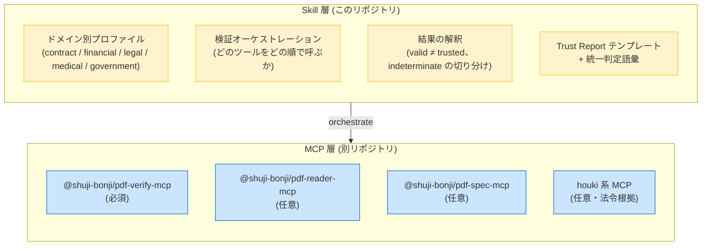

# pdf-trust-skill

[](https://opensource.org/licenses/MIT)
[](https://github.com/shuji-bonji/pdf-trust-skill)

🌐 [English version (README.md)](./README.md)

[PDF family](https://github.com/shuji-bonji#-pdf-family) の MCP サーバ群を編成して、PDF の**信頼性を監査**する **Claude Skill**。「この PDF は本物か・改ざんされていないか・信用してよいか」に対し、暗号学的署名検証・改ざん検知・PAdES/PDF-A チェック・（任意で）法令根拠の照合をドメイン別プロファイルで実行し、推奨判定付きの **Trust Report** を返します。

> **スコープ**: 本 Skill が判定するのは**真正性（authenticity）であって真偽（truth）ではありません**。文書が原本のまま完全であることを検証するものであり、内容の正しさ・法的有効性の最終判断は利用者（および必要に応じて有資格者）に委ねます。

## 何を提供するのか

このリポジトリは **MCP server ではなく Skill** です。ユーザーが「この PDF は信用できる？」と尋ねたときに、Claude が PDF family の MCP を**どう組み合わせて使うか**を Markdown でまとめた行動指針です。



### なぜ MCP ではなく Skill なのか

PDF family の設計原則は「**決定論的計算（暗号・パース）は MCP サーバ、手順・判断・知識は Skill**」。信頼性監査は純粋なオーケストレーション（プロファイル・順序・解釈）であり、サーバとして実装しても保守対象のプロセスが増えるだけです。暗号学的な実作業は `pdf-verify-mcp` が担います。

## 監査の流れ

1. **プロファイル選択** — 文書のドメイン（契約書・請求書・診療文書…）を特定し、`references/` の該当プロファイルを読み込む
2. **基礎検証**（全ファイル一括） — `verify_signatures` + `verify_integrity`
3. **結果の解釈** — 内蔵の解釈表を適用（例: *valid + trust `not_evaluated` は「暗号学的完全性のみ確認、署名者の身元は未評価」*）
4. **プロファイル別チェック** — 契約書なら署名時刻の突合、長期保存なら PDF/A + PAdES LTV、医療・行政なら PDF/UA など
5. **法令根拠**（任意） — houki 系 MCP で条文原文を出典 URL 付きで取得
6. **Trust Report** — 検査ごとの根拠ツールを明記した表 + 警告 + 次の 4 値の推奨判定:

| 判定 | 意味 |
|---|---|
| `trust_and_use` | valid + 信頼チェーン確認 + 失効なし + プロファイル必須チェック全通過 |
| `use_with_caution` | 暗号学的には valid だが身元未評価 / 失効不明 |
| `human_review_required` | indeterminate、DocMDP 違反、必須チェック不合格 |
| `reject` | invalid — ダイジェスト不一致・署名検証失敗・失効確認済み |

## ドメイン別プロファイル

| プロファイル | 想定文書 | 重点 |
|---|---|---|
| [contract](references/contract.md) | 契約書・NDA・発注書 | 署名者の身元、署名時刻の整合、PAdES B-T 以上 |
| [financial](references/financial.md) | 請求書・決算書・申告書 | 長期検証可能性（LTV・PDF/A）、電子帳簿保存法 |
| [legal](references/legal.md) | 訴訟資料・法務文書全般 | 証拠性、増分更新の全履歴 |
| [medical](references/medical.md) | 診療情報提供書・検査報告書 | 最も保守的な判定、PDF/UA |
| [government](references/government.md) | 行政文書・公共告知 | PDF/A 長期保存、PDF/UA、深い証明書チェーン（GPKI） |
| general | 上記以外 | 基礎検証のみ |

## 前提となる MCP 群

| MCP | 必須 | 役割 |
|---|---|---|
| [@shuji-bonji/pdf-verify-mcp](https://www.npmjs.com/package/@shuji-bonji/pdf-verify-mcp) | **必須** | 署名検証・改ざん検知・PAdES レベル・PDF/A 検証 |
| [@shuji-bonji/pdf-reader-mcp](https://www.npmjs.com/package/@shuji-bonji/pdf-reader-mcp) | 任意 | 署名フィールド構造・PDF/UA タグ検証・メタデータ |
| [@shuji-bonji/pdf-spec-mcp](https://www.npmjs.com/package/@shuji-bonji/pdf-spec-mcp) | 任意 | 逸脱時の ISO 32000 根拠引用 |
| [houki-egov-mcp](https://github.com/shuji-bonji/houki-egov-mcp) / [houki-nta-mcp](https://github.com/shuji-bonji/houki-nta-mcp) 等 | 任意 | 法令・通達の一次情報照合 |

任意 MCP が未接続でも縮退動作します。実施できなかった検査は黙って省略せず、レポートに「未実施（ツール未接続）」と明記されます。

```jsonc
// claude_desktop_config.json — 最小構成
{
  "mcpServers": {
    "pdf-verify-mcp": {
      "command": "npx",
      "args": ["-y", "@shuji-bonji/pdf-verify-mcp"]
    }
  }
}
```

## インストール

### A. 手動 clone（Claude Code）

```bash
mkdir -p ~/.claude/skills
cd ~/.claude/skills
git clone https://github.com/shuji-bonji/pdf-trust-skill pdf-trust
```

### B. Cowork（Claude Desktop）

Skill ディレクトリを `.skill`（zip）にパッケージし、**Settings → Capabilities → Skills** から追加。または Cowork セッションで Claude にこのリポジトリからのインストールを依頼してください。

### C. Marketplace（予定）

[shuji-bonji/claude-plugins](https://github.com/shuji-bonji/claude-plugins) への登録は**予定段階**です。登録後は次の手順で導入できるようになります:

```bash
/plugin marketplace add shuji-bonji/claude-plugins
/plugin install pdf-trust@shuji-bonji
```

## ディレクトリ構成

```
pdf-trust-skill/
├── SKILL.md                 # Claude が読み込むメインプレイブック
├── references/              # ドメイン別プロファイル（必要時にロード）
│   ├── contract.md
│   ├── financial.md
│   ├── legal.md
│   ├── medical.md
│   └── government.md
├── README.md                # 英語版
├── README.ja.md             # このファイル
└── LICENSE                  # MIT
```

## 設計メモ

- verdict の解釈は `pdf-verify-mcp` の**実測挙動**に基づく（例: 自己署名リーフを trust_anchors に渡すと「not a CA certificate」で untrusted になる、署名済み PDF の再暗号化保存は署名を正当に壊す、など）
- 構造解析だけを根拠にした「有効/無効」判断を禁止 — 真正性の主張には必ず MCP の検証結果を引用する
- 条文引用は必ず houki 系 MCP の一次情報（出典 URL 付き）から。モデルの記憶からの引用は禁止

## 評価

初版は Skill なしのベースラインと 3 シナリオ（契約書受入監査・DocMDP 改ざん検知・長期保存監査）で比較し、**アサーション 15/15 合格（ベースラインは 11/15）**。差分は統一判定語彙・ドメイン手順・法令の一次情報引用で生じました。

## ライセンス

MIT。本 Skill の出力は**技術的所見であり法的助言ではありません**。法的有効性・証拠力・規制適合の最終判断は利用者、および必要に応じて有資格者に委ねられます。

## 関連プロジェクト

| プロジェクト | 役割 |
|---|---|
| [pdf-verify-mcp](https://github.com/shuji-bonji/pdf-verify-mcp) | 真正性層 — 暗号学的検証（必須） |
| [pdf-reader-mcp](https://github.com/shuji-bonji/pdf-reader-mcp) | 実体層 — PDF 内部構造解析 |
| [pdf-spec-mcp](https://github.com/shuji-bonji/pdf-spec-mcp) | 正典層 — ISO 32000 仕様アクセス |
| [houki-research-skill](https://github.com/shuji-bonji/houki-research-skill) | 姉妹 Skill — 法令リサーチのオーケストレーション |
| [claude-plugins](https://github.com/shuji-bonji/claude-plugins) | 個人 marketplace（将来の配布チャネル） |
