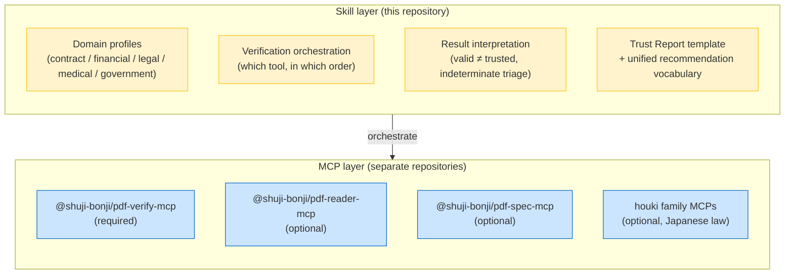

# pdf-trust-skill

[](https://opensource.org/licenses/MIT)
[](https://github.com/shuji-bonji/pdf-trust-skill)

🌐 [日本語版 (README.ja.md)](./README.ja.md)

A **Claude Skill** that orchestrates the [PDF family](https://github.com/shuji-bonji#-pdf-family) MCP servers to audit the **trustworthiness of a PDF** — is it authentic, has it been tampered with, can it be relied upon? It runs cryptographic signature verification, tamper detection, PAdES/PDF-A checks and (optionally) Japanese-law cross-referencing through domain-specific profiles, and returns a **Trust Report** with an explicit recommendation.

> **Scope note**: this skill judges **authenticity, not truth**. It verifies that a document is intact and cryptographically genuine; whether its *content* is correct or legally effective is left to the user (and, where applicable, to qualified professionals).

## What it provides

This repository is **not an MCP server — it is a Skill**: a Markdown playbook that tells Claude *how to combine* the PDF family MCPs when a user asks "can I trust this PDF?".



### Why a Skill and not an MCP server?

The PDF family follows a simple rule: **deterministic computation (cryptography, parsing, judgment) belongs in MCP servers; procedures, narrative and knowledge belong in Skills**. Since pdf-verify-mcp v0.7.0, even the 4-value verdict is computed by its deterministic `evaluate_policy` rule engine — *the judge is code, the narrative is the LLM*. The Skill orchestrates profiles and ordering, explains why rules fired, and cites legal grounds; it never overrides the verdict.

## What an audit looks like

1. **Profile selection** — infer the document domain (contract, invoice, medical record, …) and load the matching profile from `references/`
2. **Verification & verdict** (all files) — `evaluate_policy` with the chosen profile: it runs `verify_signatures` / `verify_integrity` / `detect_pades_level` (plus `validate_conformance` for preservation profiles) internally and returns the verdict with fired rule IDs. Same file + same profile = same verdict, immune to LLM drift
3. **Interpretation** — explain each fired rule with the built-in table (e.g. *POL-CAUTION-TRUST-NOT-EVALUATED means cryptographic integrity only, signer identity unverified*), deep-diving with individual tools where needed
4. **Profile checks** — e.g. signing-time cross-check for contracts, PDF/UA for medical/government (checks `evaluate_policy` doesn't cover)
5. **Legal grounding** (optional) — fetch the actual statute text via houki MCPs, with source URLs
6. **Trust Report** — findings table with per-check tool provenance, warnings, and the engine's recommendation:

| Recommendation | Meaning |
|---|---|
| `trust_and_use` | valid + trusted chain + no revocation + all required profile checks passed |
| `use_with_caution` | cryptographically valid but identity unevaluated / revocation unknown |
| `human_review_required` | indeterminate results, DocMDP violations, failed required checks |
| `reject` | invalid — digest mismatch, failed signature, or confirmed revocation |

## Domain profiles

| Profile | Typical documents | Emphasis |
|---|---|---|
| [contract](skills/pdf-trust/references/contract.md) | Contracts, NDAs, purchase orders | Signer identity, signing-time consistency, PAdES B-T+ |
| [financial](skills/pdf-trust/references/financial.md) | Invoices, financial statements, tax filings | Long-term verifiability (LTV, PDF/A), Japanese e-bookkeeping law |
| [legal](skills/pdf-trust/references/legal.md) | Litigation materials, legal documents | Evidential strength, full revision history |
| [medical](skills/pdf-trust/references/medical.md) | Referral letters, test reports | Most conservative judgments, PDF/UA |
| [government](skills/pdf-trust/references/government.md) | Administrative documents, public notices | PDF/A archival, PDF/UA, deep cert chains (GPKI) |
| general | Everything else | Base verification only |

## Prerequisite MCPs

| MCP | Required | Role |
|---|---|---|
| [@shuji-bonji/pdf-verify-mcp](https://www.npmjs.com/package/@shuji-bonji/pdf-verify-mcp) | **Yes** | Signature verification, tamper detection (**object-level revision diff from v0.10.0**), PAdES level, PDF/A validation (**PDF/A-4 from v0.11.0**). **v0.16.0 or later is recommended for the legal / medical profiles.** Two things changed. v0.15.0 stopped swallowing a `/Prev` link that could not be followed — before it, a document with 8 revisions and 5 signatures came back as having one, so a report promising the *full* revision history could not be written at all. v0.16.0 then made the answer a field, `revisionChain: { status, missing }`; until then the only signal was English prose in `notes`, and this skill decided whether it could promise a full history by matching sentences. On 0.15.x the prose fallback still works and is written out in `SKILL.md`. |
| [@shuji-bonji/pdf-reader-mcp](https://www.npmjs.com/package/@shuji-bonji/pdf-reader-mcp) | No | Signature field structure, metadata. **`locate_objects` (v0.10.0+) turns "which objects changed after signing" into a page and a rectangle** — effectively required if the report is to name locations |
| [@shuji-bonji/pdf-spec-mcp](https://www.npmjs.com/package/@shuji-bonji/pdf-spec-mcp) | No | ISO 32000 citations for deviations |
| [houki-egov-mcp](https://github.com/shuji-bonji/houki-egov-mcp) / [houki-nta-mcp](https://github.com/shuji-bonji/houki-nta-mcp) etc. | No | Japanese statute / tax-ruling grounding |

`pdf-verify-mcp` is declared in this plugin's `dependencies`, so installing the Skill installs it too (Claude Code v2.1.110 or later). Without the optional MCPs the skill degrades gracefully: skipped checks are reported as *not performed (tool not connected)* rather than silently dropped.

```jsonc
// claude_desktop_config.json — minimal setup
{
  "mcpServers": {
    "pdf-verify-mcp": {
      "command": "npx",
      "args": ["-y", "@shuji-bonji/pdf-verify-mcp"]
    }
  }
}
```

## Installation

### A. Marketplace (recommended)

Registered in [shuji-bonji/claude-plugins](https://github.com/shuji-bonji/claude-plugins):

```bash
/plugin marketplace add shuji-bonji/claude-plugins
/plugin install pdf-verify-mcp@shuji-bonji   # required MCP
/plugin install pdf-trust@shuji-bonji
```

### B. Manual clone (Claude Code)

The skill body lives under `skills/pdf-trust/`, so copy (or symlink) that directory:

```bash
git clone https://github.com/shuji-bonji/pdf-trust-skill
mkdir -p ~/.claude/skills
cp -r pdf-trust-skill/skills/pdf-trust ~/.claude/skills/pdf-trust
```

### C. Cowork (Claude Desktop)

Add the marketplace URL (`https://github.com/shuji-bonji/claude-plugins`) via **Settings → Customize → Plugins**, or download the `.plugin` file from Releases and upload it. Alternatively, package `skills/pdf-trust/` as a `.skill` (zip) file and add it via **Settings → Capabilities → Skills**.

## Directory layout

```
pdf-trust-skill/
├── .claude-plugin/
│   └── plugin.json          # Plugin manifest (marketplace form factor)
├── skills/
│   └── pdf-trust/
│       ├── SKILL.md         # Main playbook loaded by Claude
│       └── references/      # Domain profiles (loaded on demand)
│           ├── contract.md
│           ├── financial.md
│           ├── legal.md
│           ├── medical.md
│           └── government.md
├── README.md                # This file
├── README.ja.md             # Japanese version
└── LICENSE                  # MIT
```

> The skill instructions (`SKILL.md`, `references/`) are currently written in **Japanese**. Claude follows them regardless of the conversation language, and the audited PDFs can be in any language — but the built-in legal grounding targets **Japanese law** (Electronic Signature Act, e-bookkeeping preservation rules).

## Design notes

- Verdict interpretation is grounded in the actual observed behavior of `pdf-verify-mcp` (e.g. a self-signed leaf passed as a trust anchor yields *untrusted: not a CA certificate*; re-encrypting a signed PDF legitimately breaks its signature).
- The skill never lets Claude infer validity from structure alone — every authenticity claim must cite an MCP verification result.
- Statute citations must come from houki MCPs (primary sources with URLs), never from model memory.

## Evaluation

The initial release was benchmarked against a no-skill baseline on three scenarios (contract acceptance audit, DocMDP tamper detection, long-term storage audit): **15/15 assertions passed with the skill vs 11/15 without**. The gap came from unified recommendation vocabulary, domain procedures, and primary-source legal citations.

## License

MIT. This skill produces **technical findings, not legal advice**. Final decisions on legal effectiveness, evidential weight, or regulatory compliance belong to the user and, where required, qualified professionals.

## Related projects

| Project | Role |
|---|---|
| [pdf-verify-mcp](https://github.com/shuji-bonji/pdf-verify-mcp) | Authenticity layer — cryptographic verification (required) |
| [pdf-reader-mcp](https://github.com/shuji-bonji/pdf-reader-mcp) | Structure layer — PDF internals inspection |
| [pdf-spec-mcp](https://github.com/shuji-bonji/pdf-spec-mcp) | Canon layer — ISO 32000 specification access |
| [houki-research-skill](https://github.com/shuji-bonji/houki-research-skill) | Sibling orchestration skill for Japanese law research |
| [claude-plugins](https://github.com/shuji-bonji/claude-plugins) | Personal marketplace (future distribution channel) |
